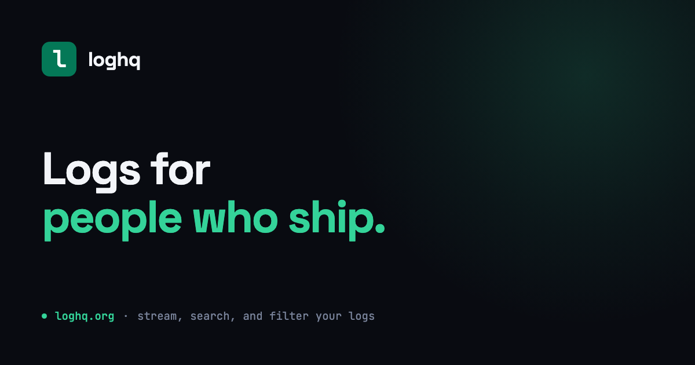
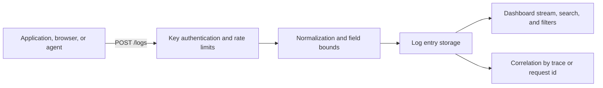

<p align="center">
  <a href="https://loghq.org">
    
  </a>
</p>

# loghq

[](https://github.com/stacksjs/loghq/actions/workflows/ci.yml)
[](https://github.com/stacksjs/loghq/actions/workflows/deploy.yml)
[](./LICENSE.md)

loghq is open source log management. Ship structured logs from anything that can make an HTTP request, then search, filter, and correlate them from one dashboard.

[Website](https://loghq.org) | [Ingest API](./docs/ingest.md) | [Issues](https://github.com/stacksjs/loghq/issues)

> [!NOTE]
> loghq is under active development. Interfaces and deployment details may change before the first stable release.

## What it does

- Accepts structured log entries over HTTP, authenticated by a public, revocable project ingest key.
- Stores every entry verbatim as a flat stream — nothing is collapsed, deduplicated, or discarded behind your back.
- Supports the eight RFC 5424 / PSR-3 severities, plus channel, environment, release, host, and arbitrary JSON context.
- Correlates entries by `trace_id` and `request_id`, so one line expands into everything that happened around it.
- Provides a project dashboard with level, channel, environment, and message filters over a keyset-paginated stream.
- Bounds every field before storage and reports exactly what it dropped, so a client can reconcile what it sent.
- Supports project members, invitations, key rotation, archiving, and deletion.
- Runs as a hosted service or on infrastructure you control.

### Not yet built

Honest about the gaps, because the alternative wastes your time:

- **No client SDKs.** Ingest is plain HTTP today — see [Send a log](#send-a-log). The install snippets on the project settings page reference packages that are not published yet.
- **Alert delivery is unwired.** Alert channels can be configured and stored, and `app/Errors/alerts.ts` implements delivery, but nothing calls it.
- **No grouping or fingerprinting.** loghq is a stream, not an issue tracker. Correlation ids are join keys, deliberately not grouping keys.

## How it works



Each entry belongs to a project. The ingest path validates the project's public key, applies payload and rate limits, bounds every field to what the schema accepts, and writes the batch in a single insert. Entries are never merged: a request for one trace id returns every line emitted under it, in order.

## Quick start

### Requirements

- [Bun](https://bun.sh) 1.3 or newer
- SQLite 3.47.2 or newer for local development
- PostgreSQL for the production configuration

### Run locally

```bash
git clone https://github.com/stacksjs/loghq.git
cd loghq
bun install
cp .env.example .env
./buddy key:generate
./buddy migrate
bun run dev
```

Open [http://localhost:3000](http://localhost:3000). The local development command starts the stx views server on `PORT` (3000 by default) and the API server on `PORT_API` (3008), both from `config/ports.ts`. `bun run dev` prints the actual URLs on startup — trust those over this paragraph if you have overridden either.

Create an account, add a project, and copy its ingest key from project settings. Local mail uses the configured development mail driver, so invitation output may be written to the application log.

## Send a log

Ingest is a single JSON `POST`. The project's ingest key goes in `X-LogHQ-Key`; it is public by design, revocable, and grants no read access.

```bash
curl -X POST http://localhost:3108/logs \
  -H 'Content-Type: application/json' \
  -H 'X-LogHQ-Key: loghq_your_project_key' \
  -d '{
    "logs": [{
      "message": "payment gateway timeout",
      "level": "error",
      "channel": "billing",
      "environment": "production",
      "release": "checkout@2.14.0",
      "trace_id": "4bf92f3577b34da6a3ce929d0e0e4736",
      "context": { "provider": "stripe", "attempt": 3 }
    }]
  }'
```

From any JavaScript runtime, with no dependencies:

```ts
await fetch('http://localhost:3108/logs', {
  method: 'POST',
  headers: { 'Content-Type': 'application/json', 'X-LogHQ-Key': key },
  body: JSON.stringify({ logs: [{ message: 'checkout started', level: 'info' }] }),
})
```

A `201` returns `{ ok, stored, dropped, skipped }`. Check those counts — a `201` does not mean every entry landed, and this is the only signal that some did not.

**[docs/ingest.md](./docs/ingest.md) is the full wire contract**: every field, every limit, the retry semantics for each status code, and what a client library is expected to handle. It is written to be implementable from scratch in any language.

## Read logs back

Dashboard endpoints, authenticated with a bearer token rather than the ingest key:

```
GET /api/projects/{projectId}/logs?level=&channel=&environment=&q=&trace=&request=&before=&limit=
GET /api/logs/{logId}
```

`level` accepts a comma-separated set. `before` is a keyset cursor. Results are newest-first.

## Configuration

Start with `.env.example`. These are the settings most installations need to review:

| Area | Variables |
| --- | --- |
| Application | `APP_NAME`, `APP_ENV`, `APP_KEY`, `APP_URL`, `DEBUG` |
| Database | `DB_CONNECTION`, `DB_HOST`, `DB_PORT`, `DB_DATABASE`, `DB_USERNAME`, `DB_PASSWORD` |
| Mail | `MAIL_MAILER`, `MAIL_HOST`, `MAIL_PORT`, `MAIL_USERNAME`, `MAIL_PASSWORD`, `MAIL_FROM_ADDRESS` |
| Queue | `QUEUE_DRIVER`, `QUEUE_CONCURRENCY`, `QUEUE_WORKER_CONCURRENCY` |
| Billing | `STRIPE_SECRET_KEY`, `STRIPE_PUBLISHABLE_KEY`, `STRIPE_WEBHOOK_SECRET` |
| Ingest quotas | `TRUSTED_PROXY_HOPS`, plus Redis settings if you want quotas shared across instances |

Do not commit plaintext environment secrets. The deployment workflow reconstructs `.env.keys` from GitHub environment secrets and uses the committed encrypted environment files.

## Development commands

| Command | Purpose |
| --- | --- |
| `bun run dev` | Start the full local site and API |
| `./buddy migrate` | Apply pending database migrations |
| `./buddy generate:migrations` | Generate model-driven migration changes |
| `./buddy test` | Run the test suite |
| `bunx --bun pickier .` | Check formatting and lint rules |
| `bunx --bun pickier . --fix` | Apply safe lint and formatting fixes |
| `bun run typecheck` | Run the TypeScript checker |

Tests live in `tests/` and use Bun's test runner. The focused unit suite covers ingest authorization and the storage shaping rules in `app/Logs/normalize.ts` — field bounds, batch overflow accounting, and correlation id handling.

> [!NOTE]
> `./buddy migrate` regenerates model-driven migrations before applying them, and may emit files duplicating hand-written ones. Review `database/migrations/` after running it. Comments in a hand-written migration must not contain semicolons: the runner splits on the statement terminator and re-emits each fragment on its own line, which turns a trailing comment into invalid SQL.

## Project structure

| Path | Responsibility |
| --- | --- |
| `app/Logs/` | Storage shaping: field bounds, batch accounting, level normalization |
| `app/Errors/` | Ingest authorization, rate limits, and alert channel delivery |
| `app/Models/` | Project, log entry, subscription, user, and alert channel models |
| `routes/` | Ingest, log stream, project, auth, and billing endpoints |
| `resources/views/` | stx marketing pages and authenticated application views |
| `resources/partials/` | Shared stx partials |
| `resources/functions/` | Auto-imported composables (must exist; the auto-import scanner throws on a missing directory) |
| `database/migrations/` | Database schema history |
| `docs/` | Wire contracts and operational documentation |
| `config/` | Typed application, database, mail, queue, and cloud configuration |
| `tests/` | Bun unit and application tests |

loghq is built with [Stacks](https://stacksjs.org), a full-stack TypeScript framework running on Bun. Templates use stx, data access uses the Stacks ORM and query builder, and production data is stored in PostgreSQL.

## Marketing site

The public site is the same app: `resources/views/index.stx` and friends, served
through stx with `resources/layouts/marketing.stx`.

The home page ends with a launch-updates capture for visitors who find the site
before they are ready to sign up. It posts to `POST /api/email/subscribe`, the
framework's `SubscriberEmailAction`, which owns the `Subscriber` model, the
unique-email constraint, and the token behind the unsubscribe link. Repeat
submissions answer `Already subscribed` rather than creating a second row.

That route is re-registered in `routes/api.ts`. The framework declares it in
`storage/framework/defaults/routes/dashboard.ts`, but the declaration does not
take effect in this app, so the endpoint 404s without the local registration.

The form carries `action` and `method`, so it still posts with scripting off;
the `<script client>` block upgrades it to an inline reply.

## Deployment

GitHub Actions provides push-to-deploy with one branch per environment:

| Branch | Environment |
| --- | --- |
| `main` | Production |
| `stage` | Staging |
| `dev` | Development |

The workflow installs locked dependencies, provisions the encrypted environment keys, runs `buddy deploy`, updates the current release, and applies additive migrations. Production is attached to the statushq Hetzner server, sharing its host and Postgres, with Porkbun DNS.

**[DEPLOY.md](./DEPLOY.md) is the full deployment reference**: topology, required secrets, what each stage does, the known first-deploy failure, and how to operate the box. Configuration lives in [.github/workflows/deploy.yml](./.github/workflows/deploy.yml) and the `tsCloud` export of `config/cloud.ts`.

## Contributing

Issues and focused pull requests are welcome. Before opening a pull request:

```bash
bunx --bun pickier .
bun run typecheck
./buddy test
```

Use conventional commit messages such as `fix: guard oversized ingest payloads` or `feat: add webhook alert channel`.

## License

loghq is available under the [MIT License](./LICENSE.md).
